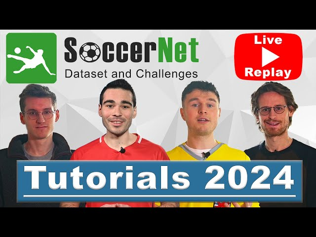

# Guidelines for the SoccerNet MV-Foul Challenge

The 2nd [SoccerNet MV-Foul challenge]() will be held from October to June 2025!
Subscribe (watch) the repo to receive the latest info regarding timeline and prizes!

SoccerNet MV-Foul is a large-scale dataset that benchmarks the tasks of a football referee, identifying fouls, determining yellow and red cards and the type of foul.
For the MV-Foul challenge, participants have to determine from multi-view clips two labels. The first labels corresponds to if it is a foul or not, i.e. No Offence, Offence + No Card, Offence + Yellow Card, Offence + Red Card, while the second label determine the type of foul, i.e. Standing Tackle, Tackle, Holding, Pushing, Challenge, Dive, High Leg, Elbowing.
SoccerNet MV-Foul is composed of 3k annotations, span 500 complete soccer games from six main European leagues, covering three seasons from 2014 to 2017.

We provide an [evaluation server](www.google.com) for anyone competing in the SoccerNet MV-Foul. 
This evaluation server handles predictions for the open **test** set and the segregated **challenge** set.

## Youtube video

Check out our video tutorial on the MV-Foul challenge!

## Who can participate / How to participate?

 - Any individual can participate in the challenge, except the organizers.
 - The participants are recommended to form a team to participate.
 - Each team can have one or more members. 
 - An individual/team can compete on both task.
 - An individual associated with multiple teams (for a given task) or a team with multiple accounts will be disqualified.
 - Participants can use any **public** dataset to pretrain their model. Any public dataset or codebase used for the challenge must be mentioned in the final report.
 - Participants are allowed to train their final model on all provided data (train + valid + test sets) before evaluating on the challenge set.
 - If you have any doubts regarding these rules, please contact the challenge administrators.

## How to win / What is the prize?

 - The winner will be the individual/team who reaches the highest **balanced accuracy** performance on the **challenge** set.
 - The deadline to submit your results is April 24th.
 - In order to be eligible for the prize, we require the individual/team to provide a short report describing the details of the methodology (CVPR format, max 3 pages)

## Important dates

Note that these dates are tentative and subject to change if necessary.

 - **October 30:** Launch of SoccerNet challenges.
 - **Mid-March:** Deadline for CVsports. We encourage participants to publish their results at the CVsports workshop! 
 - **April 24:** Deadline for the SoccerNet Challenges.
 - **May 1:** The participants have to submit a report.
 - **June TBD:** A full-day workshop at CVPR 2025.

## Clarifications on data usage

**1. On the restriction of private datasets and additional annotations**

SoccerNet is designed to be a research-focused benchmark, where the primary goal is to compare algorithms on equal footing. This ensures that the focus remains on algorithmic innovation rather than data collection or annotation effort. Therefore:
* Any data used for training or evaluation must be publicly accessible to everyone to prevent unfair advantages.
* By prohibiting additional manual annotations (even on publicly available data), we aim to avoid creating disparities based on resources (e.g., time, budget, or manpower). This aligns with our commitment to open-source research and reproducibility.

**2. On cleaning or correcting existing data**

We recognize that publicly available datasets, including SoccerNet datasets, might have imperfections in their labels (around 5% usually). Cleaning or correcting these labels is allowed outside of the challenge period to ensure fairness:
* Participants can propose corrections or improvements to older labels before the challenge officially starts. Such changes will be reviewed and potentially integrated into future versions of SoccerNet. Label corrections can be submitted before or after the challenge for inclusion in future SoccerNet releases, ensuring a fair and consistent dataset during the competition.
* During the challenge, participants should not manually alter or annotate existing labels, as this introduces inconsistency and undermines the benchmark's fairness.
* Fully automated methods for label refinement or augmentation, however, are encouraged. These methods should be described in the technical report to ensure transparency and reproducibility.

**3. Defining “private datasets”**

A dataset is considered “private” if it is not publicly accessible to all participants under the same conditions. For example:
* Older SoccerNet data are not private, as they are available to everyone.
* However, manually modifying or adding annotations (e.g., bounding boxes or corrected labels) to older SoccerNet data during the challenge creates a disparity and would be considered "private" unless those modifications are shared with the community in advance.

**4. Creative use of public data**

We fully support leveraging older publicly available SoccerNet data in creative and automated ways, as long as:
* The process does not involve manual annotations.
* The methodology is clearly described and reproducible.
* For instance, if you develop an algorithm that derives additional features or labels (e.g., bounding boxes) from existing data, this aligns with the challenge's goals and is permitted.

**5. Data sharing timeline:**

To ensure fairness, we decided that any new data must be published or shared with all participants through Discord at least one month before the challenge deadline. This aligns with the CVsports workshop timeline and allows all teams to retrain their methods on equal footing.

## Contact

For any further doubt or concern, please raise a GitHub issue in this repository, or contact us directly on [Discord](https://discord.gg/SM8uHj9mkP).
